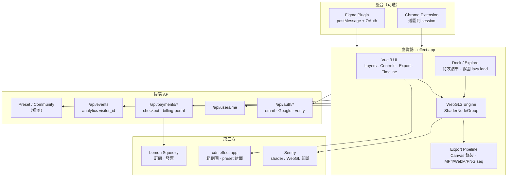
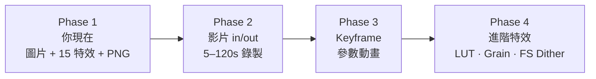

# Effect.app 參考網站

> 來源：[https://effect.app/](https://effect.app/)  
> 最後整理：2026-05-30（含 production bundle 技術棧反推；含 WebCodecs 匯出路徑）

## 目錄

1. [技術棧總覽](#技術棧總覽反推自-production)
2. [系統架構圖](#系統架構圖可截取區塊)
3. [可截取區塊與路線圖](#你可以截取哪些部分)
4. [後端 API / 方案上限 / Bundle](#後端-api-端點bundle-反推)
5. [產品功能與定價](#產品定位)
6. [與 FXCanvas 對照](#與本專案fxcanvas對照)

> **FXCanvas 必做基礎清單（P0/P1）：** [mvp-baseline.md](./mvp-baseline.md)  
> **完整特效 ID + 解密 GLSL：** [effect-app-effects-list.md](./effect-app-effects-list.md) · [`effect-app-shaders/`](./effect-app-shaders/)  
> **slug → shader → FXCanvas 移植優先級：** [effect-app-porting-priority.md](./effect-app-porting-priority.md)

---

## 技術棧總覽（反推自 production）

> 依據 [effect.app](https://effect.app/) HTML、`/assets/*.js` chunk 與 HTTP headers 整理。前端 bundle 有 obfuscation，但核心 class 名與 GLSL 字串仍可辨識。

| 層級 | 技術 | 證據 / 說明 |
|------|------|-------------|
| 部署 | **nginx** 靜態站 | `server: nginx`，`content-type: text/html` |
| 建置 | **Vite** | `type="module"` + hash chunk（`index-*.js`、`ShaderNodeGroup-*.js`） |
| UI 框架 | **Vue 3** | bundle 內 Sentry 整合含 `__isVue`、`[VueViewModel]` |
| 監控 | **Sentry** | `__SENTRY_DEBUG__`、shader compile 失敗上報 |
| 渲染 | **自研 WebGL2 引擎**（Shadertoy 風格） | `ShaderNode`、`ShaderNodeGroup`、`ImageEffectRenderer` |
| 特效定義 | **GLSL fragment + uniform 註解** | `mainImage()`、`// uniform float foo // label=...` |
| 影片 | **HTMLVideoElement / VideoFrame** | texture upload 分支 |
| 匯出 | **WebCodecs `VideoEncoder` 優先**，失敗則 **MediaRecorder** | bundle：`webcodecsMuxer-*.js`（~519KB）、`captureStream`、analytics `webcodecs_video` / `mediarecorder_*` |
| 後端 | **REST API**（推測 FastAPI） | `/api/auth/*`、`REGISTER_*` 錯誤碼風格 |
| 訂閱 | **Lemon Squeezy** | HTML 連結 `app.lemonsqueezy.com`、checkout / billing-portal |
| 整合 | Figma Plugin、Chrome Extension | `frame-ancestors figma.com`、postMessage OAuth |

### 渲染引擎（核心，可對照 FXCanvas）

Effect.app 的 GPU 管線與 [Shadertoy](https://www.shadertoy.com/) 高度同源，再包一層產品化的 node graph：

```
媒體輸入 (圖/影片/VideoFrame)
        │
        ▼
┌───────────────────┐
│ ImageEffectRenderer│  ← 共用 WebGL2 context（可 useSharedContext）
│  · iTime / iFrame  │
│  · iResolution     │
│  · iMouse (可選)   │
│  · iChannel0–7     │  ← 最多 8 路 texture slot
└─────────┬─────────┘
          │ 每層 ShaderNode
          ▼
┌───────────────────┐
│ Nt (ping-pong FBO)│  ← frameBuffer0 / frameBuffer1 雙緩衝
│  multi-pass 特效   │
└─────────┬─────────┘
          │
          ▼
   Canvas 2D blit 或直出 WebGL canvas
```

**Shader 編譯策略**

- 偵測 shader 類型：`mainImage` → Shadertoy 包裝；`#version 300 es` → 原生 ES 3.0
- 使用 `KHR_parallel_shader_compile` 非同步連結 program
- Uniform 由 GLSL 註解解析為 UI 控件（`ge` int、`float`、`vec2/3/4`）
- `@animated`、`@feedback channel=N` pragma 控制動畫與 feedback pass

**與 FXCanvas (`src/lib/engine/renderer.ts`) 的對應**

| Effect.app | FXCanvas |
|------------|----------|
| `ShaderNodeGroup` + `ShaderNode` | `EffectRenderer` + `effects/*.ts` |
| `iChannel` ping-pong | `fbos` ping-pong |
| uniform 註解 → 自動 UI | `u_` + param name 綁定 |
| `ImageEffectRenderer` 時間軸 | 尚無（待 keyframe） |

---

## 系統架構圖（可截取區塊）



---

## 你可以「截取」哪些部分？

依 **FXCanvas 目標**（本地 WebGL 編輯器、無帳號）與 **實作成本** 分級：

| 區塊 | 建議 | 難度 | 說明 |
|------|------|------|------|
| **WebGL2 特效堆疊 + ping-pong FBO** | ✅ 優先 clone | 中 | 你已有 `renderer.ts`；可對齊 multi-pass、layer opacity |
| **Uniform 驅動參數面板** | ✅ 已有 | 低 | Effect 用 GLSL 註解；你用 TS effect 定義，等價 |
| **預覽降採樣、匯出原圖** | ✅ 已有 | 低 | `PREVIEW_MAX_DIM` 策略與其 FAQ 一致 |
| **Explore / 分類 / 搜尋 / Favorites** | ✅ 大部分已有 | 低 | Dock hover 縮圖可再加 |
| **Canvas 縮放平移、Space 對比** | ✅ 已有 | 低 | — |
| **Undo 本機 stack** | ✅ 已有 | 低 | 他們是雲端 version history |
| **Preset localStorage** | ✅ 已有 | 低 | 他們是 API + 社群審核 |
| **單張 PNG/JPEG 匯出** | ✅ 已有 | 低 | — |
| **Shadertoy 式 `mainImage` + iChannel** | ⚠️ 選做 | 中 | 可讓進階用戶貼 GLSL；需沙箱與編譯錯誤 UX |
| **影片 decode + 時間軸** | 📋 下一階段 | 高 | `HTMLVideoElement` + `requestAnimationFrame` 逐幀 |
| **MediaRecorder MP4/WebM** | 📋 下一階段 | 高 | 瀏覽器差異大（Firefox 無 MP4） |
| **Keyframe 參數動畫** | 📋 長期 | 很高 | Animate 方案核心 |
| **真・誤差擴散 dither** | 📋 長期 | 高 | CPU worker 或 compute |
| **Film Grain 貼圖庫** | 📋 中期 | 中 | 18 種 stock 紋理 + tonal weighting |
| **LUT 系（Vintage / B&W Film）** | 📋 中期 | 中 | 3D LUT texture 或 2D strip |
| **帳號 / OAuth / Email verify** | ❌ 不建議 clone | 高 | 與本地 privacy 定位衝突 |
| **Lemon Squeezy / 浮水印 / 方案牆** | ❌ 不建議 | 中 | 商業模式，非編輯器核心 |
| **Community Preset 審核** | ❌ 不建議 | 高 | 需後端 + moderation |
| **Figma / Chrome 整合** | ❌ 選用 | 高 | 獨立產品線 |
| **Sentry + shader 診斷** | ⚠️ 選用 | 低 | 開發期有用，MVP 可略 |

### 建議的「截取」路線圖



**Phase 1（對齊 Effect 免費版核心）**：圖層堆疊、即時預覽、preset、undo、靜態匯出 — **FXCanvas 已覆蓋約 70%**。

**Phase 2（Pro 賣點）**：`HTMLVideoElement` → texture、動畫長度、FPS 選擇；匯出時 **`VideoEncoder`（WebCodecs）+ 獨立 muxer chunk**，不支援則 fallback `canvas.captureStream()` + `MediaRecorder`。

**Phase 3（Animate）**：每個 uniform 的 keyframe track、時間軸 UI、匯出時插值。

**Phase 4（品質差異化）**：Film Grain、Vintage LUT、Blob Tracker 等需專用 shader + 資產的特效。

### 實作覆蓋率（2026-05-29）

| Phase | 對齊 Effect 方案 | FXCanvas 狀態 |
|-------|------------------|---------------|
| Phase 1 | Free 核心編輯 | **約 70%** — 圖層、特效、undo、preset、PNG/JPEG |
| Phase 2 | Pro 影片匯出 | **0%** — 待做 |
| Phase 3 | Animate Keyframes | **0%** — 待做 |
| Phase 4 | 進階特效資產 | **部分** — Dither/Star Glow 有，Grain/LUT 無 |

### FXCanvas 內建 Preset：Vintage print（2026-05-29 v2）

#### 與 effect.app 差異（為何舊版不像）

| 面向 | effect.app | 舊 FXCanvas 近似 | v2 修正 |
|------|------------|------------------|---------|
| 半色網 | **RGB HATCH** — R/G/B 各自旋轉網點、套色錯位 | 灰階 `dither` palette 1 | 新增 `rgb_halftone` |
| 色彩 | 保留品紅/青/黃網點（Risograph） | 末端 `duotone` 暖褐色 flatten | 移除 duotone，改 Risograph dither 22% 疊加 |
| 紙張 | **PAPER SCAN** 紋理貼圖感 | `noise` ×3 糊在一起 | `paper_grain` ×2（前後各一層） |
| 邊框 | **PRINT STAMP** 紙邊 / 留白 | 只有 `vignette` | 新增 `print_stamp` |
| 堆疊 | ~10 層專用 shader | 12 層通用特效錯序 | 10 層、順序對齊 |

#### v3 優化（2026-05-29）

- **RGB Halftone**：改為白紙上三色版 **multiply 疊印**（不再 mix 糊成一團）
- **Print Stamp**：修正遮罩（中心顯示圖、邊緣留白）
- **Paper Grain**：overlay 紙紋混合
- **Soft Bleed**：新增墨水滲開層
- Preset 精簡為 9 層、網點 `cellSize` 3.5

#### v2 圖層對照

| effect.app | FXCanvas v2 |
|------------|-------------|
| BLUR/SHARP | `gaussian_blur` |
| CURVES | `exposure` |
| LEVELS | `levels` |
| PAPER SCAN | `paper_grain` |
| RGB HATCH | **`rgb_halftone`** |
| RISO / 網點細節 | `dither`（pattern 12 + palette 6，opacity 0.22） |
| PAPER SCAN | `paper_grain` |
| NOISE | `noise`（opacity 0.65） |
| PRINT STAMP | **`print_stamp`** |
| 邊角 | `vignette` |

- 程式：`src/lib/presets/builtin.ts`、`src/lib/effects/rgb_halftone.ts`
- UI：**PRESETS → OLD PAINTING → Vintage print**

---

## 後端 API 端點（bundle 反推）

> Auth chunk 內 `fetch('/api/...')` 字串整理。實際 schema 以 server 為準。

| 方法 | 路徑 | 用途 |
|------|------|------|
| POST | `/api/auth/register` | Email 註冊 |
| POST | `/api/auth/login` | 登入（FormData） |
| POST | `/api/auth/logout` | 登出 |
| POST | `/api/auth/verify` | Email 驗證碼 |
| POST | `/api/auth/request-verify-code` | 重發驗證碼 |
| GET | `/api/auth/google/authorize` | Google OAuth URL |
| GET | `/api/auth/figma/google/authorize` | Figma 內 Google OAuth |
| GET | `/api/auth/figma/google/status/{read_key}` | Figma OAuth 輪詢 token |
| POST | `/api/auth/figma/login` | Figma 內登入 |
| POST | `/api/auth/figma/logout` | Figma 內登出 |
| GET | `/api/users/me` | 讀取個人資料 |
| PATCH | `/api/users/me` | 更新 username / avatar |
| DELETE | `/api/users/me` | 刪除帳號（推測） |
| POST | `/api/payments/checkout` | 建立 checkout（tier + variant） |
| GET | `/api/payments/billing-portal` | 訂閱管理入口 |
| POST | `/api/payments/change-plan` | 升降級 |
| POST | `/api/events` | 訪客 / 行為 analytics（`visitor_id`） |

**常見錯誤碼（前端處理）**

| code | 情境 |
|------|------|
| `REGISTER_USER_ALREADY_EXISTS` | 註冊 email 重複 |
| `REGISTER_INVALID_PASSWORD` | 密碼不符規則 |
| `LOGIN_BAD_CREDENTIALS` | 帳密錯誤 |
| `LOGIN_USER_NOT_VERIFIED` | 未驗證 → 導向 code modal |
| `VERIFY_USER_BAD_TOKEN` | 驗證碼錯誤 |
| `VERIFY_USER_ALREADY_VERIFIED` | 已驗證 |
| `MISSING_TOKEN_OR_INACTIVE` | Figma token 無效 |

---

## 方案上限（`planLimits` 模組）

| tier | `exportRes` | `maxDuration`（秒） | `totalPresets` |
|------|-------------|---------------------|----------------|
| free | 1080 (`0x438`) | 5 | 0（僅基本控制） |
| pro | 4096 (`0x1000`) | 120 | 10 |
| animate | 4096 | 300（5 分鐘） | ∞ |
| ultra | 16384 (`0x4000`) | 7200（2 小時） | ∞ |

價格（USD，模組內常數）：Pro $12/月、$72/年；Animate $20/月、$216/年。

---

## 影片匯出管線（2026-05-30 bundle 確認）

```
逐幀渲染 (WebGL2 + iTime)
        │
        ▼
┌─────────────────────────────┐
│ typeof VideoEncoder !==     │
│ 'undefined' 且格式 MP4/WebM │
└─────────────┬───────────────┘
              │ yes
              ▼
┌─────────────────────────────┐
│ dynamic import              │
│ webcodecsMuxer-*.js (~519KB)│
│ VideoEncoder 編碼 + mux     │
└─────────────┬───────────────┘
              │ fail / 不支援
              ▼
┌─────────────────────────────┐
│ canvas.captureStream()      │
│ MediaRecorder（實際 FPS）   │
└─────────────────────────────┘
```

- 啟動前會檢查 `WEBGL2_NOT_AVAILABLE`（與 HTML 內 WebGL2 gate 一致）。
- Sentry 會區分 `webcodecs_video` vs `mediarecorder` 事件，便於監控匯出失敗率。

---

## 前端 Bundle 清單（2026-05-29 production build）

| Chunk（當前 hash） | 職責 |
|-------------------|------|
| `index-U6-EUb5Y.js` (~431KB) | 主應用、匯出、Sentry、WebCodecs lazy load |
| `ShaderNodeGroup-ClbxQos4.js` (~92KB) | WebGL2 引擎、`ShaderNode`、`ImageEffectRenderer` |
| `webcodecsMuxer-vzfiK-BB.js` (~519KB) | WebCodecs 影片編碼 / mux（動態 import） |
| `Auth-Swr-_3UP.js` | 登入、Modal、`fetch('/api/...')`、Figma postMessage |
| `Dock-9mhlp63-.js` | Explore dock、lazy 縮圖 |
| `features-Drrf7zVA.js` | `/features` 落地頁（首訪 `/` 會 `replace` 到此） |
| `planLimits-DIl0aaUJ.js` | `free/pro/animate/ultra` 權限比較 |
| `pro-Cb3A2uY9.js` | Pro 相關 UI |
| `prices-DocspJXq.js` | 定價 |
| `getEffectId-BYq6i50o.js` | 特效 ID 對照 |
| `masonry-Bh38fb22.js` | Explore 瀑布流布局 |
| `tooltip-D789i6ZX.js` | Tooltip |
| `SurveyPanel-abEgfW5f.js` | 問卷 |
| `nullCheck-DkLdxic9.js` | DOM 工具 |

**CSP 重點**：`frame-ancestors` 允許 `https://www.figma.com`；`script-src` 含 `'wasm-unsafe-eval'`（可能給 codec/wasm 路徑）。

**HTML 行為（非 bundle）**

- 首訪 `/` 且無 UTM 參數 → `location.replace('/features')`（`explore_redirected` localStorage）。
- 面板寬高：`selector_panel_state`、`anim_panel_state` 寫入 CSS 變數 `--selector-panel-width`、`--anim-panel-height`。
- 字體：`CommitMono.woff2`；第三方：`GTM-52KNGTRX`、`cdn.effect.app`、`lemonsqueezy`。

---

## 反推方法紀錄

| 項目 | 內容 |
|------|------|
| 分析日期 | 2026-05-30 |
| 來源 | `curl -sI https://effect.app/`、`curl` HTML + `/assets/*.js`、`strings` 抽離保留字串 |
| 限制 | JS 經 obfuscation（字串陣列 + 移位解密）；**class 名與 GLSL 模板字串仍明文** |
| 未含 | 後端語言/資料庫、shader 原始庫原始碼、完整 preset/community API schema |

---

## 產品定位

**Effect.app** 是一款在瀏覽器內運行的**即時影像／影片特效編輯器**，主打：

- 本地端處理（不上傳、不儲存媒體檔）
- 即時 WebGL 特效預覽
- 圖片與影片皆可套用效果
- 可儲存自訂 Preset、分享至社群
- 提供 Figma Plugin 與 Chrome Extension 整合

標語：**Online Image & Video Effect Generator – Free**

---

## 技術需求

| 項目 | 說明 |
|------|------|
| 核心技術 | **WebGL 2**（必須） |
| 建議瀏覽器 | Chrome、Safari（最穩定）；Edge、Firefox 可用 |
| 硬體 | 需開啟硬體加速 |
| 行動裝置 | iPad / 手機可用，但重度特效與匯出建議用桌面版 |
| 隱私 | 所有處理在本地瀏覽器完成，NDA 安全 |

---

## 介面結構

```
┌─────────────────────────────────────────────────────────────┐
│ Header: Logo · Load Media · Feedback · Sign in · Export    │
├──────────┬──────────────────────────────┬───────────────────┤
│          │                              │                   │
│ 左側     │         Canvas / Preview     │   右側 Layers     │
│ Controls │         (媒體預覽)            │   (圖層堆疊)       │
│ / Effects│                              │                   │
│          │                              │                   │
├──────────┴──────────────────────────────┴───────────────────┤
│ Timeline / Animation controls (Animate 方案)                 │
└─────────────────────────────────────────────────────────────┘
```

### 主要 UI 區塊

| 區塊 | 功能 |
|------|------|
| **Load Media** | 上傳圖片或影片 |
| **左側 Controls** | 特效列表、參數調整（可切換 Left 位置） |
| **Canvas** | 即時預覽（Media preview 可開關） |
| **Layers** | 圖層管理、Add、Upload |
| **Export** | 匯出面板（格式、解析度、動畫長度、FPS） |
| **Animation** | 時間軸與 Keyframe 控制（Animate 方案） |

### 設定選項

- **Media preview**：On / Off
- **Controls 位置**：Left

---

## 核心功能

### 1. 即時特效（Realtime Effects）

- 高解析度圖片與影片載入
- 特效堆疊（Layer stack）
- 即時預覽，無需離開瀏覽器
- 持續新增特效與改進

### 2. Preset 系統

- 建立自訂外觀並儲存為 Preset
- 內建策展 Preset 集合（可瀏覽、微調、學習）
- **Publish to Community**：提交至社群（需審核）
- **Public link access**：公開連結分享
- 可更換封面圖（Change cover）

| 方案 | Preset 數量 |
|------|-------------|
| Free | 基本控制 |
| Pro | 最多 10 個自訂 Preset |
| Animate | 無上限 |

### 3. 版本歷史（Version History）

- Free 方案即包含
- 可回溯編輯狀態

### 4. 動畫與 Keyframes（Animate 方案）

- 在時間軸上設定 Keyframe，動畫化特效參數
- 靜態圖片也可套用動態特效並匯出影片
- Keyframe timeline controls
- Reusable animation settings

### 5. 匯出（Export）

#### 靜態圖片

| 格式 | 說明 |
|------|------|
| PNG | 預設靜態匯出 |
| JPEG | 支援 |

#### 影片 / 動畫

| 格式 | 說明 |
|------|------|
| MP4 | Chrome / Safari 支援；Firefox 不支援 |
| WebM | 全瀏覽器 |
| PNG Sequence | 逐幀無損匯出 |
| Frames | 逐幀模式 |

#### 匯出參數

| 參數 | 選項 |
|------|------|
| **Animation 長度** | Off / 5s / 10s（Pro 最長 120s；Animate 最長 5 分鐘） |
| **Frame Rate** | 24 / 30 / 60 FPS |
| **解析度** | Free 最高 1080p；Pro 最高 4K（不超過原檔解析度） |

> **注意**：匯出為即時錄製，實際 FPS 取決於機器效能。若機器只能跑 20 FPS，即使選 60 FPS 匯出結果仍約 20 FPS。

#### 浮水印

- Free：有浮水印
- Pro / Animate：無浮水印

### 6. Dynamic Effects Export（Pro）

- 動態特效匯出（含靜態圖片的動畫 loop，Pro 可匯出 10 秒 loop）

---

## 方案與定價

| 方案 | 月費 | 年費優惠 | 用途 |
|------|------|----------|------|
| **Free** | $0 | — | 非商業用途、試用 |
| **Pro** | $12/月 | 年付省 10% | 商業授權、完整功能 |
| **Animate** | $20/月 | 年付省 10% | Keyframe 動畫、長片匯出 |

### Free 方案

- Version history
- 匯出最高 1080p
- 影片匯出最長 5 秒
- Core effects library
- Basic preset controls
- Figma plugin

### Pro 方案（Free 全部 +）

- 無浮水印
- 商業授權
- Dynamic effects export
- 4K 解析度匯出
- 120 秒影片匯出
- 最多 10 個自訂 Preset

### Animate 方案（Pro 全部 +）

- Keyframe 動畫特效
- 最長 5 分鐘影片匯出
- 無上限自訂 Preset
- Keyframe timeline controls
- Reusable animation settings

### 付款

- 訂閱制（Lemon Squeezy）
- 支援支付寶 / 微信（部分地區）
- 可透過購買確認信或 Pricing 選單管理訂閱

---

## 帳號系統

| 方式 | 說明 |
|------|------|
| Email + 密碼 | 註冊需 email 驗證碼 |
| Google OAuth | Continue with Google |
| 免登入 | Free 方案可不註冊直接使用 |

### 個人資料

- User name、Email 編輯
- Subscription 管理
- 帳號永久刪除（Danger zone）

---

## 外部整合

| 整合 | 連結 |
|------|------|
| **Figma Plugin** | [Figma Community](https://www.figma.com/community/plugin/1504395974062742075/effect-app-real-time-image-video-effects) |
| **Chrome Extension** | [Chrome Web Store](https://chromewebstore.google.com/detail/fkgcdohdgkkcpldoojdljaondijgcaik) |
| **iOS** | Coming soon |
| **Instagram** | [@effect_app](https://www.instagram.com/effect_app) |
| **Support** | [Telegram](https://t.me/effect_app) / support@effect.app |

### Figma Plugin

- 在 Figma 內直接對任意 frame 套用特效
- 無需離開 Figma 編輯圖片

### Chrome Extension

- 將任意圖片傳送至目前 Effect.app session

---

## 社群與內容

- **Community Tab**：使用者分享的 Preset（需審核）
- **Blog**：[`/blog`](https://effect.app/blog)
- **Changelog**：[`/changelog`](https://effect.app/changelog)
- **FAQ**：[`/faq`](https://effect.app/faq)
- **Features**：[`/features`](https://effect.app/features)

---

## 設計理念

| 原則 | 說明 |
|------|------|
| **Private by design** | 本地處理，檔案不離開機器 |
| **Art-directed** | 精簡介面，保留塑造視覺風格的核心控制 |
| **Always improving** | 頻繁更新特效與功能 |
| **Small team** | 獨立小團隊，快速迭代 |

---

## 常見問題摘要

### 效能

- 特效為即時渲染，效能取決於機器與瀏覽器
- 優化建議：降低解析度、簡化特效堆疊、關閉其他分頁、停用隱私/廣告阻擋擴充功能、開啟硬體加速

### 匯出問題

- 匯出卡住：先試短片段、低解析度、關閉最重特效
- 壓縮感過重：改用 PNG Sequence 無損匯出，再用 Premiere / DaVinci / AE 組裝
- Mac QuickTime 無法播放 MP4：改用 VLC 或瀏覽器；或用 HandBrake 轉 MOV

### 動畫

- Free：靜態圖只能匯 PNG；要匯動畫需上傳影片
- Pro：靜態圖也可匯出 10 秒動畫 loop
- Keyframes 僅 Animate 方案

---

## 與本專案（FXCanvas）對照

> 最後更新：2026-05-30（**v0.12.0**）

| 功能 | Effect.app | FXCanvas |
|------|------------|----------|
| 渲染引擎 | WebGL 2 | WebGL 2 |
| 媒體類型 | 圖片 + 影片 | 圖片 + 影片 |
| 特效堆疊 Layers | ✅ | ✅ |
| 圖層複製 / 顯示隱藏 | ✅ | ✅ duplicate + eye toggle |
| 左側特效面板 | ADJUST / EFFECTS / PRESETS + Explore | **ADJUST / EFFECTS / ANIMATED / PRESETS** 四 tab |
| ADJUST 微調區 | Curves、Levels、Blur… | ✅ 9 個（含 Curves 編輯器、Gradient Map、DOF） |
| Explore 瀏覽頁 | ✅ | ✅ `/explore` + `?tab=animated` |
| 內建 Preset | Vintage print 等策展 stack | ✅ **5 組** + GPU 縮圖（v0.12.0 恢復） |
| 縮圖 hover 前後對比 | ✅ | ✅（EFFECTS + PRESETS） |
| Canvas 原圖對比 | Media preview On/Off | ✅ 按住 Space 顯示原圖 |
| Canvas 縮放 / 平移 | ✅ | ✅ 滾輪縮放 + 拖曳平移 + 雙擊重置 |
| Undo / Redo | ✅（Version history 雲端） | ✅ 本機 stack 歷史（⌘Z / ⌘⇧Z，最多 50 步） |
| Preset 儲存 | ✅ 雲端 + 社群 | ✅ localStorage（最多 20 組，整個 stack） |
| 匯出 PNG / JPEG / WebP | ✅ | ✅ + 尺寸預設（Original / 50% / 1080p / 4K） |
| 匯出 MP4 / WebM | ✅ | ✅ WebM（Safari 優先）；MP4 視瀏覽器 |
| 動畫 / Keyframes | ✅ Animate 方案 | ✅ 基礎：Timeline + ◆ keyframe + 插值 |
| 程序動畫 shader | ✅ 多效果 | ⚠️ 僅 **MSX ASCII**（`u_time` / `animmode`） |
| Curves / Gradient Map | ✅ | ✅ v0.12.0 ADJUST tab |
| Dither Pro | ✅ | ✅ Dither Pro shader（ordered + serpentine；非真 FS） |
| 真・誤差擴散 Dither | ✅ Pro | ❌ |
| Emboss / Threshold / Ink Bleed | ✅ | ✅ v0.12.0 EFFECTS tab |
| Bloom / CRT / Glitch 等 | ✅ | ✅ 面板 **9 ADJUST + 15 EFFECTS + 1 ANIMATED** |
| Session 自動存檔 | — | ✅ 圖片 stack + keyframes + sourceCredit；影片不存 |
| Favorites 持久化 | ✅ 帳號 | ⚠️ localStorage（分Tab 暫隱） |
| 帳號 / 訂閱 / 浮水印 | ✅ | ❌ |
| Figma / Chrome 整合 | ✅ | ❌ |
| 本地端處理 | ✅ | ✅ |

### 仍待實作（Phase 路線圖）

| 優先 | 項目 | 狀態 |
|------|------|------|
| P0 | Vercel Git 自動部署 | push 後需手動 `vercel deploy --prod` |
| P1 | Keyframe 時間軸拖曳編輯 | 僅 playhead ◆ 切換 |
| P1 | 更多 ANIMATED 效果 | Glitch VHS / CRT 加 `u_time` |
| P1 | Effect.app porting 第二波 | WIP：thermal、motion_trails、blob_tracker、layer_mix |
| P1 | CI smoke / scenario | ✅ 四 tab + PRESETS（v0.12.0） |
| P2 | 影片 session 存檔 | 目前 skip |
| P2 | PNG 序列動畫匯出 | 僅 WebM/MP4 |
| P3 | 真・Floyd-Steinberg dither | CPU / compute pass |
| P3 | Canva / Figma 外掛 | 未開始 |

### Dither（effect.app 對照）

Effect.app 使用 **WebGL 即時 shader**，參數以數值 slider 呈現（非下拉選單）。核心流程：

1. **Gamma** — 線性空間運算
2. **Pixel step** — 像素化取樣
3. **Pattern type** — 抖動矩陣（Bayer / 誤差擴散系）
4. **Palette type + color count** — 調色盤量化
5. **Distance mode** — 調色盤最近色演算法（RGB / 感知）
6. **Dither strength** — 閾值偏移強度
7. **Inverse gamma** — 輸出

| 參數 | 範圍 | FXCanvas 預設 | 說明 |
|------|------|---------------|------|
| pattern type | 0–9 | 9 | Bayer 2/4/8、Clustered、Diagonal、Blue noise、FS/Atkinson look、Cross hatch、Noise |
| palette type | 0–6 | 6 | Mono、Gray、RGB、Game Boy、CGA、EGA、Risograph |
| color count | 2–32 | 15 | 量化色階數 |
| distance mode | 0–1 | 1 | 0=RGB² 距離，1=感知加權 |
| dither strength | 0–4 | 2.0 | 抖動強度 |
| gamma | 0.5–3 | 1.6 | 伽馬校正 |
| pixelStep | 1–8 | 2 | 像素化步長 |

**實作檔案：** `src/lib/effects/dither.ts`

> Effect.app Pro 另有 Floyd-Steinberg / Atkinson 等 **真・誤差擴散**（需逐像素 CPU 或多 pass GPU）；FXCanvas 以 ordered + serpentine 近似，即時預覽零延遲。

| 參數 | 說明 | 預設 |
|------|------|------|
| highlight boost | 亮部門檻／抽取強度（愈高愈只留高光） | 0.93 |
| streaks | 星芒射線數（2–8） | 3 |
| sample count | 每條射線取樣步數 | 30 |
| length | 射線長度（像素尺度） | 80 |
| alternate | 奇偶射線長度交替 | 1.00 |
| falloff | 沿射線衰減 | 0.45 |
| angle deg | 整體旋轉（度） | 0 |
| Colorize | 漸層著色混合量 | 1.00 |
| Gradient map | 三階色標（沿射線 t 取樣） | 白→淺藍→深藍 |
| Gradient shift | 漸層相位偏移 | 0.29 |

**技術**：WebGL2 fragment shader；自亮部沿多方向做 line gathering；與 Bloom（柔光暈）不同，屬星芒／十字濾鏡類效果。詳見 [effect.app/effects/star-glow](https://effect.app/effects/star-glow)。

---

## 相關連結

- 官網：[https://effect.app/](https://effect.app/)
- Features：[https://effect.app/features](https://effect.app/features)
- FAQ：[https://effect.app/faq](https://effect.app/faq)
- Changelog：[https://effect.app/changelog](https://effect.app/changelog)
- Privacy：[https://effect.app/privacy](https://effect.app/privacy)
- Terms：[https://effect.app/terms](https://effect.app/terms)
- CDN 範例圖：`https://cdn.effect.app/features/media/`
